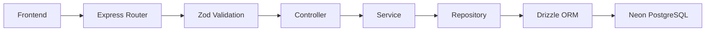

# KUBO Reservation Management System

## Overview

This repository contains a **PERN** (PostgreSQL, Express, React, Node) stack application that uses **Drizzle ORM** for type‑safe database interactions and **Zod** for request validation. The backend lives in the `backend/` directory and can be connected to a PostgreSQL instance hosted on **Neon**.

## Architecture Overview

The backend follows a **feature‑based (module) architecture**. Each business feature lives under `src/modules/<feature>/`.

```
src/
 └─ modules/
      ├─ room/
      │   ├─ repository/
      │   │   ├─ room.model.ts
      │   │   ├─ room.queries.ts
      │   │   └─ room.relations.ts
      │   ├─ routes/
      │   │   └─ room.routes.ts
      │   ├─ controllers/
      │   │   └─ room.controllers.ts
      │   ├─ services/
      │   │   └─ room.services.ts
      │   └─ validations/
      │       └─ room.validation.ts
      └─ ... (other features)
```

The `repository` folder lives directly under each feature folder (no intermediate `entities` layer).

**Naming conventions**

- **Models / Queries / Relations**: `room.model.ts`, `room.queries.ts`, `room.relations.ts`
- **Routes**: `room.routes.ts`
- **Controllers**: `room.controllers.ts`
- **Services**: `room.services.ts`
- **Zod schemas**: `room.validation.ts`

**Layer flow**

1. **Request** arrives at Express router.
2. **Zod validation** checks request payload.
3. Router forwards to **controller**.
4. Controller calls **service** for business logic.
5. Service uses **repository** (queries) to interact with **Drizzle ORM**.
6. Drizzle generates SQL and communicates with **PostgreSQL (Neon)**.



---

## Contributing

1. **Fork** the repository on GitHub.
2. Clone your fork locally: `git clone <your-fork-url>`.
3. Create a new branch for your work: `git checkout -b feature/your-feature-name`.
4. Make your changes, commit them, and push to your fork.
5. Open a **Pull Request** against the upstream `main` branch.

Follow the existing coding style and run the test suite before submitting.

---

## Prerequisites

| Tool             | Minimum version |
| ---------------- | --------------- |
| **Node.js**      | 18.x (LTS)      |
| **npm**          | 9.x             |
| **git**          | any             |
| **Neon account** | –               |

> **Note**: The frontend lives in a separate directory (not covered here). This guide focuses on getting the backend up and running.

---

## 1. Clone the repository

```bash
git clone <repository-url>
cd KUBO_ReservationManagementSystem/backend
```

---

## 2. Install dependencies

```bash
npm ci   # or `npm install` if you prefer the default install flow
```

---

## 3. Set up the Neon PostgreSQL database

1. Sign‑in to the **Neon** console (https://console.neon.tech).
2. Create a new **Project** → **PostgreSQL** instance.
3. In the project’s **Settings**, copy the **Connection string** (it looks like `postgresql://<user>:<password>@<host>/<dbname>?sslmode=require`).
4. In the **backend** folder (the same directory as `package.json`), copy the example environment file and fill in your values:

```bash
cp example.env .env
```

_Note:_ The `.env` file should reside in the backend root directory, **not** inside the `src/` folder.

Edit `.env` (any editor) and provide at least the following variables:

```dotenv
# Server configuration
PORT=4000                # any free port you prefer
NODE_ENV=development    # or "production" when deploying

# Neon connection string (required)
DB_URL=postgresql://<user>:<password>@<host>/<dbname>?sslmode=require

# CORS – URL of the frontend that may call the API
FR_ORIGIN=http://localhost:3000

# Minimum password length for user accounts (optional, adjust as needed)
PASSWORD_LENGTH=8
```

> **Tip**: If you plan to run the backend in production, change `NODE_ENV` to `production` and ensure the `FR_ORIGIN` points to the deployed front‑end URL.

---

## 4. Generate the type‑safe SQL queries

The project defines its database schema using **Drizzle ORM** model files located under `src/modules/**/models/*.ts`. To generate the corresponding query helpers and migration files, run:

```bash
npm run db:generate
```

This command executes `drizzle-kit generate` which reads the schema definitions and produces a set of ready‑to‑use query functions under `src/generated/` (or the folder configured in `drizzle.config.ts`).

---

## 5. Apply migrations to Neon

After generation, apply the migrations to the remote Neon database:

```bash
npm run db:migrate
```

`drizzle-kit migrate` will create the required tables and indexes on the Neon instance. The command is idempotent – running it again will only apply new migrations.

---

## 6. Run the backend server

### Development mode (auto‑restart on file changes)

```bash
npm run dev
```

The server will start on the port defined in `.env` (default `4000`). Nodemon watches the source files and restarts the process on changes.

### Production build & run

```bash
npm run build   # compiles TypeScript to JavaScript in `dist/`
node dist/server.js   # or use a process manager like PM2
```

---

## 7. Verify the connection

You can quickly test that the backend can talk to Neon by hitting a health‑check endpoint (if defined) or simply checking the console output after running `npm run dev`. You should see a line similar to:

```
Server is running on port 4000
Server Connected to Database Successfully
```

If the connection fails, double‑check the `DB_URL` value in `.env` and ensure the Neon project allows connections from your IP (Neon defaults to allowing all IPs).

---

## 8. Common troubleshooting

| Symptom                                      | Likely cause                    | Fix                                                                                  |
| -------------------------------------------- | ------------------------------- | ------------------------------------------------------------------------------------ |
| `Failed to connect to the database`          | Wrong `DB_URL` or network block | Verify the Neon connection string and that your IP is whitelisted.                   |
| `npm run db:generate` prints _no migrations_ | No model files detected         | Ensure schema files are under `src/modules/**/models/*.ts` and exported correctly.   |
| CORS errors in the browser                   | `FR_ORIGIN` mismatch            | Set `FR_ORIGIN` to the exact origin (including protocol and port) of your front‑end. |

---

## 9. Further reading

- **Drizzle ORM docs** – https://orm.drizzle.team/
- **Neon documentation** – https://neon.tech/docs
- **Zod validation** – https://zod.dev/

---
