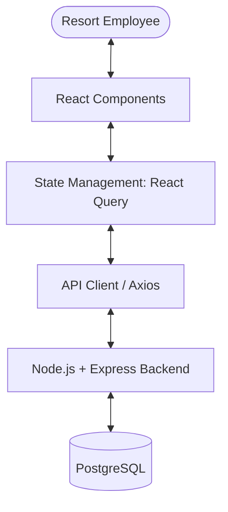
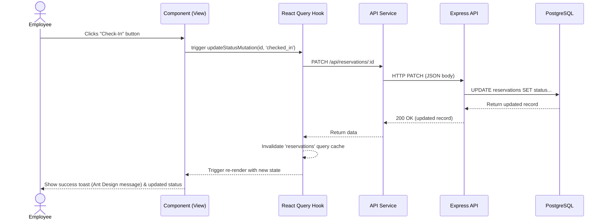

# Frontend Architecture Document

## KUBO Reservation Management System - Resort Admin Dashboard

**Version:** 1.0.0
**Date:** September 2026

---

## 1. Frontend Architecture Overview

The KUBO Resort Admin Dashboard is designed as a modern Single Page Application (SPA) utilizing Vite, React, and TypeScript. The frontend architecture mirrors the backend's feature-based modularity, ensuring seamless integration, high maintainability, and clear separation of concerns.

The application communicates with a robust Node.js/Express backend via RESTful APIs, providing an intuitive, fast, and scalable employee-facing dashboard to manage the entire resort's operations, from guest reservations to room inventory and payments.

To maintain a clean and scalable codebase, we strictly enforce several **Anti-Spaghetti Guardrails**, including strict import boundaries, standardized cross-feature communication, and centralized constants.



## 2. Recommended Project Structure

To maintain consistency with the backend's feature-based module architecture and to keep the codebase scalable, we use a **Feature-Sliced Design** approach. Each feature encapsulates its own UI components, business logic (hooks), data fetching (services), and type definitions.

```text
src/
├── assets/                 # Static assets (images, fonts)
├── components/
│   ├── layout/             # Shell, Sidebar (Sider), Header components using Ant Design Layout
│   └── shared/             # Custom composite components built on top of antd
├── config/                 # Environment variables, app configuration
├── constants/              # Global constants and enums (NO magic strings)
├── features/               # Feature-based modules
│   ├── additional-charge/  # Additional charges management
│   ├── audit-log/          # Audit logging and viewing
│   ├── employee/           # Employee/staff management
│   ├── guest/              # Guest CRUD records
│   ├── payment/            # Payment processing and tracking
│   ├── reservation/        # Reservation lifecycle management
│   ├── room/               # Room inventory
│   └── room-type/          # Room type definitions
│       ├── components/     # Feature-specific components
│       ├── hooks/          # Feature-specific React Query/custom hooks
│       ├── pages/          # Feature-specific route entries/page components
│       ├── services/       # API call definitions for this feature
│       ├── types/          # Feature-specific TypeScript interfaces/schemas
│       └── index.ts        # Feature Barrel Export (CRITICAL: All cross-feature imports go here)
├── hooks/                  # Global shared hooks (e.g., useWindowSize, useTheme)
├── lib/                    # Core utilities and API client setup (Axios wrapper)
├── routes/                 # Application routing setup (React Router)
├── styles/                 # Global styles, CSS Modules, antd theme overrides
├── types/                  # Global shared TypeScript types
├── utils/                  # Pure utility functions (formatting, validation helpers)
├── App.tsx                 # Root application component (ConfigProvider setup)
└── main.tsx                # Application entry point
```

### Constants/Enums File Convention
A `src/constants/` folder is strictly required for all global enumerations and static values. **Magic strings are forbidden** for values like statuses, roles, error codes, and payment methods. Always import these values from the centralized constants directory.

## 3. Layer Responsibilities

Our architecture strictly adheres to the principle of separation of concerns, divided into the following layers:

1. **Pages (`features/*/pages/`)**: 
   - Serve as entry points for routes.
   - Responsible for fetching initial state requirements using hooks.
   - Compose feature components and layout components.
   - Do not contain complex UI logic or direct API calls.

2. **Components (`features/*/components/` & `components/`)**:
   - Purely presentational or focused on specific user interactions.
   - Receive data via props or consume state via custom hooks.
   - `components/shared/` contains reusable composite components built combining Ant Design components.
   - Ant Design (antd) provides our core UI primitives (Buttons, Tables, Forms, Modals), so we don't build generic UI atoms from scratch.

3. **Hooks (`features/*/hooks/`)**:
   - Encapsulate business logic and state management.
   - heavily utilize React Query (`useQuery`, `useMutation`) to interface with services.
   - Prepare and transform data for components.

4. **Services (`features/*/services/`)**:
   - Responsible for direct communication with the API.
   - Contain Axios calls corresponding to backend REST endpoints.
   - Do not hold state; pure asynchronous functions returning Promises.

5. **API Client (`lib/api.ts`)**:
   - The global configured HTTP client (Axios or fetch wrapper).
   - Handles base URLs, interceptors (for auth tokens or error handling), and common headers.

## 4. State Management Strategy

To prevent prop-drilling and maintain a clean separation between server and client state:

- **Server State (TanStack React Query)**: 
  The primary source of truth for the dashboard is the backend. We use React Query to manage data fetching, caching, synchronization, and optimistic updates. This is crucial for real-time dashboards like reservation management where data changes frequently.
  
- **Client/UI State (React Context / Zustand)**: 
  For transient UI state (e.g., sidebar collapse state, current theme, active modals that span across components) that doesn't belong to the server, we utilize React Context. If the client state grows in complexity, a lightweight tool like Zustand can be integrated.

- **Form State (Ant Design Form / React Hook Form + Zod)**: 
  Forms can be heavily managed using Ant Design's built-in `Form` component which is robust for most administrative needs. For highly complex or dynamic forms requiring strict schemas, React Hook Form coupled with Zod can be used alongside Ant Design components.

## 5. API Integration Layer

The application interacts with the backend RESTful API via a typed HTTP client wrapper (Axios).

### API Client Setup (`src/lib/api.ts`)
- Configured with `baseURL` derived from environment variables.
- Interceptors handle automatic attaching of authentication tokens and global error handling (e.g., redirecting to login on `401 Unauthorized`).

### Supported Patterns
- **RESTful Endpoints**: Methods mapped clearly to endpoints (`GET /api/reservations`, `POST /api/guests`, etc.).
- **Query Parameters**: Built-in support for DB-level pagination, sorting, and filtering provided by the backend. Example: `GET /api/reservations?status=confirmed&page=1&limit=20`.

## 6. Routing

Routing is managed by **React Router v6**. We utilize layout routes to maintain the dashboard shell across all authenticated pages, leveraging Ant Design's `Layout`, `Sider`, `Header`, and `Content` components.

```mermaid
graph TD
    Root[/ ] --> Auth[Auth Layout]
    Root --> Dashboard[Dashboard Layout]
    
    Auth --> Login[/login]
    
    Dashboard --> Home[/dashboard]
    Dashboard --> Reservations[/reservations]
    Dashboard --> Guests[/guests]
    Dashboard --> Rooms[/rooms]
    Dashboard --> Employee[/employees]
    Dashboard --> Settings[/settings]
```

- **Protected Routes**: A wrapper component ensures that unauthenticated users are redirected to the login screen.
- **Nested Routing**: Used extensively for complex features (e.g., `/reservations` listing and `/reservations/:id` detail view).

## 7. Authentication Considerations (Placeholder)

*Note: The exact authentication mechanism (JWT, Session Cookies, OAuth) is pending final backend implementation.*

- **Expected Flow**:
  1. User authenticates via `/api/auth/login`.
  2. Backend responds with an HTTP-only cookie or a JWT.
  3. Frontend stores the token (if JWT) securely or relies on the browser to send cookies.
  4. The API Client includes credentials in all subsequent requests.
- **Role-Based Access Control (RBAC)**: The dashboard will dynamically render navigation items and restrict actions based on the Employee's role fetched from the backend profile.

## 8. Data Flow Diagram

The following diagram illustrates the flow of data when an employee updates a reservation status.



## 9. Key Architectural Decisions & Anti-Spaghetti Guardrails

### A. TypeScript Everywhere
**Rationale:** The backend uses TypeScript, and utilizing it on the frontend ensures end-to-end type safety. Types for API responses and request payloads can be easily modeled, reducing runtime errors.

### B. Feature-Based Folder Structure
**Rationale:** A flat structure grouped by file type (all components together, all hooks together) becomes unmanageable in large enterprise apps. Grouping by feature encapsulates domain logic, making it easier for developers to find relevant code, onboard quickly, and safely delete or refactor features.

### C. Ant Design (antd) v5+
**Rationale:** 
- **Comprehensive UI Framework**: Ant Design provides a vast suite of pre-built, high-quality components specifically tailored for enterprise-level administrative interfaces, drastically reducing development time compared to building from scratch or using simpler libraries.
- **Styling and Theming**: We utilize Ant Design's modern CSS-in-JS design tokens for global theme customization (via `ConfigProvider`), entirely eliminating the need for external CSS frameworks like TailwindCSS. For component-level custom styling, standard CSS Modules ensure perfectly scoped styles without conflicts.

### D. React Query over Redux
**Rationale:** Most of the dashboard's state is "server state" (guests, reservations, rooms). Redux requires massive amounts of boilerplate to handle asynchronous data fetching, loading states, and caching. React Query handles all of this natively with zero boilerplate, improving performance and developer experience.

### E. Native Ant Design Forms / Zod Validation
**Rationale:** Ant Design's robust built-in `Form` component is the standard choice for most data entry tasks, offering built-in validation rules and effortless integration with other antd components. Where forms reach exceptional complexity or strict schema parity with the backend is strictly required, Zod can still be layered in to validate form models prior to submission.

### F. Import Boundary Rules (Guardrail)
**Rule:** Cross-feature imports MUST go through the feature's `index.ts` barrel export.
**Rationale:** To prevent tightly coupled "spaghetti" code, you may **never** import from a feature's internal folders directly (e.g., `import X from '@/features/guest/components/GuestList'`). Instead, features must expose their public API via an `index.ts` file at their root.

### G. Cross-Feature Communication Pattern (Guardrail)
**Rule:** Circular dependencies between features are explicitly forbidden.
**Pattern:** When features need to share data or interact, they must follow this structured hierarchy:
1. **Shared Hooks**: Extract common logic to global `src/hooks/`.
2. **Props-Based Composition**: Pass data downwards through props from a shared parent page.
3. **Feature Barrel Exports**: Import public services or types from another feature's `index.ts` (strictly respecting the Import Boundary Rule).

### H. Error Handling Pattern for Mutations (Guardrail)
**Rule:** Use a standardized `useAppMutation` wrapper hook.
**Pattern:** Instead of handling success and error toasts manually in every component, all data mutations must use a `useAppMutation` custom wrapper around `@tanstack/react-query`'s `useMutation`. This wrapper standardizes the display of Ant Design `message` components for success ("Updated successfully") and error ("Failed to save changes") toasts globally across the app.

### I. Path Aliases (Guardrail)
**Rule:** Define and use `@/` path aliases for all imports.
**Rationale:** Deep relative paths (e.g., `import { X } from '../../../../components/X'`) are fragile, error-prone, and hard to read. All imports must utilize the `@/` alias (mapped to the `src/` directory in `tsconfig.json` and Vite configuration).
